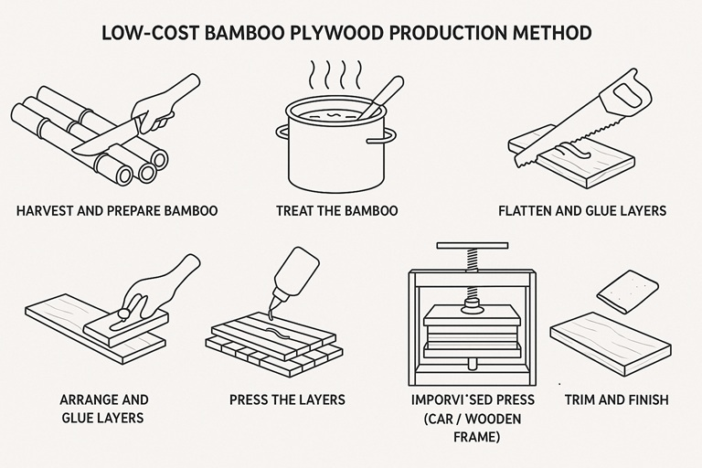

Here is a low-cost method for converting bamboo into bamboo plywood, suitable for small-scale or DIY production. 
**The process involves splitting, treating, flattening, gluing, and pressing bamboo strips.**

